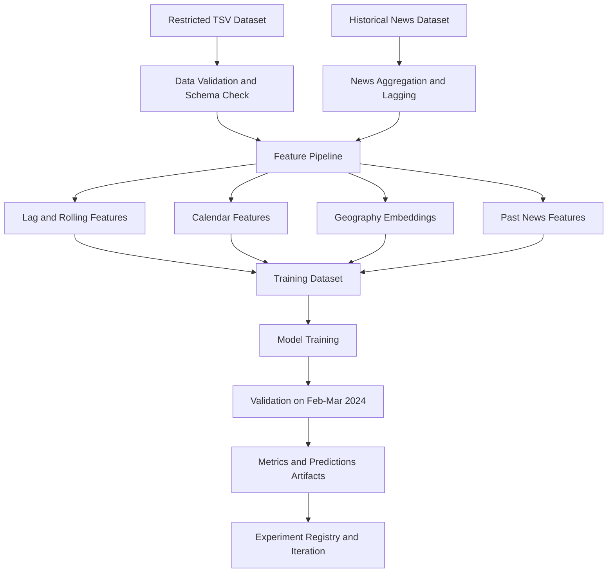

# Prediction Mobility Project Architecture

This document describes how to implement the HuMob mobility prediction project end to end, from data intake to iterative model improvement.

## 1. Goals

- Build a reproducible OD flow forecasting pipeline for the HuMob Challenge 2026 dataset.
- Keep a stable baseline for benchmarking.
- Add geography embedding features (recommended: `srai` style regional embeddings) for performance gains.
- Provide a clear path from local experiments to team-level delivery.

## 2. Scope and Constraints

- Data is restricted and must follow challenge usage terms.
- Prediction target is aggregated OD flow volume.
- Spatial unit is approximately 2 km grid cells in Noto / Ishikawa area.
- Time regime is fixed by challenge split.

## 3. Architecture Overview



## 4. Layered Design

### 4.1 Data Layer

- Input: challenge TSV file.
- Responsibilities:
  - Load data with strict dtypes and date parsing.
  - Validate required columns and null behavior.
  - Enforce deterministic sorting by `(origin, destination, date)`.
- Output: clean canonical table used by feature generation.

### 4.2 Feature Layer

- Baseline features:
  - Lags: 1, 2, 3, 7, 14 days per OD pair.
  - Rolling stats: lagged 7-day mean/std.
  - Calendar: day-of-week, month, weekend.
- News features (optional):
  - Daily article count.
  - Daily average text length and/or score.
  - Lagged news aggregates (lag-1, lag-3 mean, lag-7 mean) to avoid leakage.
- Geography embedding features (next stage):
  - Origin embedding vector.
  - Destination embedding vector.
  - Optional OD interaction features (dot product, distance buckets, neighborhood overlap).
- Output: model-ready matrix `X` and target `y`.

### 4.3 Modeling Layer

- Baseline model: tree ensemble (RandomForest).
- Near-term upgrade path:
  - LightGBM/XGBoost for stronger tabular performance.
  - Hybrid model combining embedding vectors and tabular features.
- Output: trained model object and reproducible inference behavior.

### 4.4 Evaluation Layer

- Validation period: 2024-02-01 to 2024-03-31.
- Metrics:
  - MAE
  - RMSE
- Artifacts:
  - metrics.json
  - validation_predictions.csv
  - experiment metadata (feature set, model parameters, timestamp).

### 4.5 Delivery Layer

- Reproducible CLI entrypoint.
- Versioned outputs folder structure.
- Team documentation and runbook for handoff.

## 5. Suggested Project Structure (Target State)

```text
Prediction_Mobility/
  data/
    raw/                      # restricted data, ignored by git
    processed/
  docs/
    experiments/
  src/
    humob_baseline.py         # current baseline pipeline
    features/
      temporal.py
      geo_embedding.py
    models/
      train_baseline.py
      train_embedding.py
    evaluation/
      metrics.py
  outputs/
  ARCHITECTURE.md
  README.md
  requirements.txt
```

## 6. Geography Embedding Integration Plan

`srai` is the primary recommendation for this project because it is designed to represent spatial units (for example grid/H3 cells) as vectors for downstream prediction tasks.

Reference reading for GIS embedding intuition:

- ArcGIS Blog: An introduction to embeddings for GIS analysts
  - https://www.esri.com/arcgis-blog/products/arcgis-pro/geoai/an-introduction-to-embeddings-for-gis-analysts

How this concept maps to our OD prediction task:

- Embedding = dense numeric vector that encodes spatial context.
- For our case, each origin grid and destination grid gets an embedding vector.
- Similar areas should have similar vectors, so the model can generalize to sparse OD pairs.
- These vectors are concatenated with lag/calendar/news features before model training.

Integration steps:

1. Define region IDs for origin/destination (existing grid IDs or mapped H3 IDs).
2. Build or load region embeddings using a consistent method.
3. Join embedding vectors to each row as `origin_emb_*` and `dest_emb_*`.
4. Concatenate with existing lag/calendar features.
5. Retrain and compare against baseline MAE/RMSE.

Fallback if embedding training cost is high:

- Start with learned ID embeddings via target encoding or shallow neural embedding.
- Replace with `srai` embeddings once pipeline stabilizes.

## 7. Execution Phases

### Phase 1: Baseline Stabilization

- Freeze schema checks and feature definitions.
- Ensure deterministic outputs and reproducibility.

### Phase 2: Embedding MVP

- Add geography embedding feature generator.
- Compare baseline vs embedding-enhanced model.

### Phase 3: Model Hardening

- Add stronger learners and robust validation diagnostics.
- Track experiments with fixed naming/versioning.

### Phase 4: Submission Pipeline

- Add challenge-format prediction exporter.
- Add one-command run from raw data to submission file.

## 8. Risk Register and Mitigation

- Data schema drift risk:
  - Mitigation: explicit column mapping via CLI and schema validation.
- Sparse OD pairs risk:
  - Mitigation: embedding features + smoothing + robust fallback features.
- Temporal leakage risk:
  - Mitigation: strict lag construction and date-based split checks.
- News leakage risk:
  - Mitigation: only use lagged news features (no same-day future information).
- Reproducibility risk:
  - Mitigation: fixed random seeds, explicit dependency versions, and artifact logging.

## 9. Definition of Done

- Pipeline runs end-to-end from one command.
- Validation metrics are reproducible across runs.
- Embedding-enhanced model shows measurable gain over baseline or is rejected with documented evidence.
- Documentation is sufficient for another team member to run without additional guidance.
